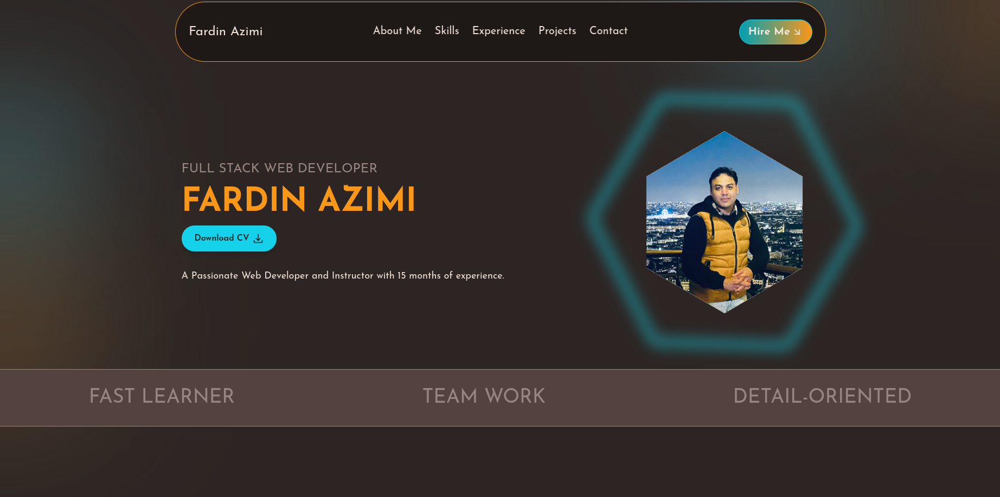

# Fardin Azimi Portfolio



A modern, responsive portfolio website built with React and Vite, showcasing my professional experience and projects.

## 🚀 Technologies Used

### Core Technologies

- **React 18**: Modern UI development with the latest features
- **Vite**: Next-generation frontend tooling for faster development
- **TailwindCSS**: Utility-first CSS framework for responsive design

### UI/UX Enhancements

- **Framer Motion**: Powerful animation library for smooth transitions
- **React Icons**: Comprehensive icon library
- **React Scroll**: Smooth scrolling between sections

### State Management & Form Handling

- **Redux Toolkit**: Efficient state management
- **Formik**: Form handling and validation

### Contact Form Features

- **EmailJS**: Email service integration for contact form
- **React Toastify**: Toast notifications for user feedback

## 📋 Features

- **Responsive Design**: Fully responsive across all devices
- **Animated UI**: Smooth animations and transitions
- **Interactive Contact Form**: With email functionality
- **Experience Timeline**: Visual representation of work history
- **Project Showcase**: Portfolio section with project details

## 🛠️ Setup & Installation

1. Clone the repository

```bash
git clone [repository-url]
```

2. Install dependencies

```bash
npm install
```

3. Start development server

```bash
npm run dev
```

## 📧 Contact Form Configuration

The contact form is integrated with EmailJS for handling email functionality:

- Auto-reply feature for form submissions
- Real-time form validation
- Loading states and success/error notifications

## 🎨 Styling

- TailwindCSS for responsive design
- Custom animations with Framer Motion
- Modern and clean UI design

## 🔧 Development

```bash
# Run development server
npm run dev

# Build for production
npm run build

# Preview production build
npm run preview
```
